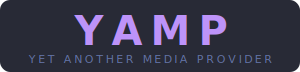

<p align="center"></p>

**YAMP** (Yet Another Media Provider) is a [Plex Custom Metadata Provider](https://developer.plex.tv/pms/) for YouTube videos downloaded with [yt-dlp](https://github.com/yt-dlp/yt-dlp) or [MeTube](https://github.com/alexta69/metube).

It reads `.info.json` sidecar files to populate Plex with rich metadata — title, description, upload date, channel, genres, thumbnails — and organises videos into Plex collections using a rule-based system you manage through a built-in web UI.

## Why

Plex deprecated their legacy Python plugin framework in 2026. This replaces the original `.bundle` agent (preserved in [`legacy/`](legacy/)) with a proper HTTP-based provider that works with PMS 1.43.0+.

## Features

- **Auto-metadata** from `.info.json`: title, description, upload date, duration, channel (as director), genres, thumbnail as poster art
- **Multi-platform support** — indexes videos from YouTube, Bilibili, and any other yt-dlp extractor; ID detection is regex-based with a JSON fallback for non-standard filename templates
- **Thumbnail proxy** — YAMP always serves thumbnails through its own proxy; local files first, remote URL as fallback. No `YAMP_URL` needed — YAMP derives its own address from each incoming request
- **Collection rules** driven by tags, title substrings, or channel name
- **Collection poster images** — set a URL in the UI and YAMP pushes it to Plex as the collection artwork on save; existing Plex posters are pre-loaded when you open the editor
- **Fast saves** — collection matching uses an in-memory metadata cache (no disk I/O); image/name-only edits skip recompute entirely; Plex artwork sync and rescan run in the background so saves return immediately
- **Web UI** at `http://localhost:8765` to add/edit/delete collections and rules
- **Discover panel** — browse unmatched (or all) videos, search by title/channel/tag, click any tag to instantly create a collection from it; click a video thumbnail in a collection to search for it in the Discover panel
- **Rescan button** — trigger a Plex metadata refresh directly from the UI
- **Fix Thumbnails button** — backfill thumbnails for all existing videos; preserves existing Plex posters for videos where YAMP has no thumbnail to offer
- **Version display** — running version shown in the UI header (matches the Docker image tag)
- **Makefile** for common dev tasks: `make test`, `make build`, `make dev`, `make docker-up`, etc.
- **Docker Compose** setup with Plex + MeTube + YAMP all sharing one volume

## Requirements

- Plex Media Server **1.43.0+**
- Videos downloaded with yt-dlp or MeTube with `writeinfojson: true`
- Docker (recommended) or Python 3.11+ with [uv](https://github.com/astral-sh/uv)

## Quick Start

```bash
git clone https://github.com/aarro/the-last-plex-plugin
cd the-last-plex-plugin

# 1. Edit provider/docker-compose.yml — set the youtube-data volume device path
# 2. Create provider/.env with PLEX_URL, PLEX_TOKEN, PLEX_CLAIM

make docker-up
```

Then in Plex: **Settings → Troubleshooting → Metadata Agents → Add Agent** → enter `http://<host>:8765/movies`.

See [CLAUDE.md](CLAUDE.md) for full documentation.

## Repo Layout

```
the-last-plex-plugin/
├── CLAUDE.md          # Full developer docs
├── provider/          # YAMP HTTP provider (FastAPI + React UI)
└── legacy/            # Original .bundle agent (reference only)
```

## Inspiration

- [ZeroQI's Youtube Agent](https://github.com/ZeroQI/YouTube-Agent.bundle)
- [JordyAlkema's Youtube-DL Agent](https://github.com/JordyAlkema/Youtube-DL-Agent.bundle)
- [TubeArchivist Plex Integration](https://github.com/tubearchivist/tubearchivist-plex)
